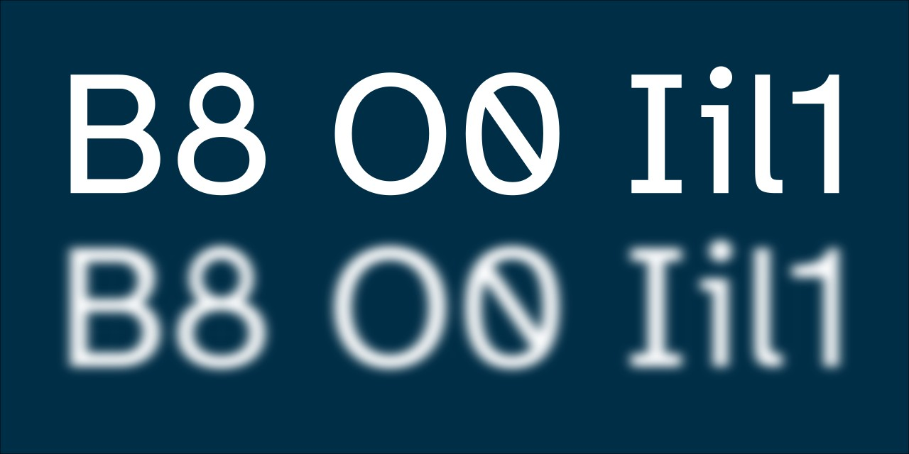

# [Atkinson Hyperlegible Pro](https://jacobxperez.github.io/atkinson-hyperlegible-pro/)

An updated and extended version of [Atkinson Hyperlegible](https://github.com/googlefonts/atkinson-hyperlegible).

---


## Table of Contents

* [Overview](#overview)
  * [Design Features](#design-features)
  * [Installing](#installing-the-font)
  * [Language Support](#language-support)
* [Flip the Zero](#flipping-the-zero)
* [Contributing](#contributing)
* [License](#license)

## Overview

Atkinson Hyperlegible Pro is an updated and extended version of the original typeface, which was initially designed for The Braille Institute and named after its founder, J. Robert Atkinson. It was specifically designed to improve character recognition and legibility for low-vision readers by incorporating distinctive and unambiguous letterform’s. The typeface was a Winner of Fast Company’s 2019 Innovation By Design Award.

* Four fonts, including two weights (regular, italic, bold, bold italic)
* An additional 199 glyphs supporting 91 languages
* Supports 303 orthographies according to [Hyperglot](https://hyperglot.rosettatype.com/)
* 2,264 total glyphs across all fonts, 566 per font
* Improve legibility and readability for low vision readers
* Updated kerning for visual harmony and readability
* Includes common use ligatures `fi ff ffi fl ffl`
* Alternative reversed number zero `0`

## Design Features

Designed for low-vision readers, certain letters and numbers can be hard to distinguish from one another. Atkinson Hyperlegible Pro differentiates common misinterpreted letters and numbers using various design techniques: B vs. 8, 1 vs. L vs. l vs. I. Recognizable Footprints: Character boundaries are clearly defined, ensuring understanding across the visual-ability spectrum.

> `Q vs G, E vs F, p vs q, i vs r, O vs 0`

Differentiated letterform’s: Similar letter pairs are differentiated from each other to dramatically increase legibility. Unambiguous Characters: designed to increase legibility and distinction.

> `ER79jr Vsa36`

Exaggerated forms: Shaping of letters is exaggerated to provide better clarity. Opened Counterspace: Open areas of certain letters are expanded to provide greater distinction.

> `aGbgrpqu Åö8ij%?¡:`

Angled spurs and differentiated tails: Increase recognition and define distinctive style. Circular Details: Links to the history of Braille Institute and braille dots.

## Installing the Font

* [Download](https://github.com/jacobxperez/atkinson-hyperlegible-pro/archive/refs/heads/main.zip) the font from the main branch or from the [release](https://github.com/jacobxperez/atkinson-hyperlegible-pro/archive/refs/heads/release.zip) branch.
* Extract the file to reveal additional folders inside. Find the Open Type Format (.otf) files for the four Atkinson Hyperlegible Pro fonts (regular, italic, bold, bold italic) inside the “[fonts/otf](https://github.com/jacobxperez/atkinson-hyperlegible-pro/tree/main/fonts/otf)” folder.
* Note: Only the otf files are needed to install the font on a computer.
* On Windows 10: Double-click the font file, then click the “Install” button in the font preview window that opens. The font will be installed. Alternatively, right-click on the file and choose “Install” from the pop-up menu.
* On Mac: Double-click the font file in the Finder, then click “Install Font” in the font preview window that opens. After your Mac validates the font and opens the Font Book app, the font is installed and available for use.

## Language Support

Afrikaans Albanian Asu Basque Bemba Bena Breton Catalan Chiga Colognian Cornish Croatian Czech Danish Dutch Embu English Esperanto Estonian Faroese Filipino Finnish French Friulian Galician German Gusii Hungarian Icelandic Indonesian Irish Italian Kabuverdianu Kalenjin Kamba Kikuyu Kinyarwanda Latvian Lithuanian Lower Sorbian Luo Luxembourgish Luyia Machame Makhuwa-Meetto Makonde Malagasy Maltese Manx Meru Morisyen North Ndebele Norwegian Bokmål Norwegian Nynorsk Nyankole Oromo Polish Portuguese Quechua Romanian Romansh Rombo Rundi Rwa Samburu Sango Sangu Scottish Gaelic Sena Serbian Shambala Shona Slovak Soga Somali Spanish Swahili Swedish Swiss German Taita Teso Turkish Upper Sorbian Uzbek (Latin) Vietnamese Volapük Vunjo Walser Welsh Western Frisian Zulu.

## Flipping the Zero

By default the zero remains with a backslash `\` this was done to prevent confusion with the Danish Ø however, when pairing the typeface with a monospace that only supports a forwardslash `/` zero, this may create a cognitive dissonance problem. On that occasion you might want to flip the zero by adding `font-variant-numeric: slashed-zero;` to your CSS file.

```css
body {
  font-family: "Atkinson Hyperlegible Pro", "Atkinson Hyperlegible", Helvetica, Arial, sans-serif;
  font-size: 100%;
  font-weight: 400;
  font-variant-numeric: slashed-zero;
}
```

## Contributing

Help us improve Atkinson Hyperlegible Pro for everyone, any contribution or feedback is welcome.
Please read our [contributing guidelines](https://github.com/jacobxperez/atkinson-hyperlegible-pro/blob/main/.github/CONTRIBUTING.md)
before embarking on any significant pull request.

## License

SIL Open Font License, v1.1. See [LICENSE.txt](LICENSE.txt) for details.

---

Learn more at [The Braille Institute](https://brailleinstitute.org/freefont).
